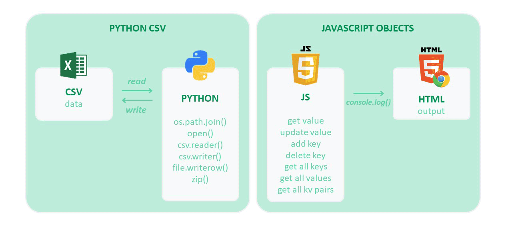

### Cheat Sheet ###
------

> This class uses [Python 3.8](https://www.python.org/), HTML and JavaScript.


### Prerequisites ###
------

1. Download and install [Python 3.x](https://www.python.org/downloads/)
2. Add Python path to your [System Environment Variables](http://www.aaronstannard.com/how-to-setup-a-proper-python-environment-on-windows/)
3. Install pip to manage your Python packages


### Python ###
------

To run Python in the Command Line
```
$ python <your_python_file_name>.py
```


To import python libraries
```python
import os, csv
```


To setup file path
```python
csvpath = os.path.join('..', '<your_folder_name>', '<your_csv_file_name>.csv')
```

To read file content
```python
with open(csvpath, 'r', newline='') as csvfile:
    csvreader = csv.reader(csvfile, delimiter=',')
    for row in csvreader:
        print(row)
```

To write content to file
```python
with open(csvpath, 'a', newline='') as csvfile:
    csvwriter = csv.writer(csvfile, delimiter=',')
    csvwriter.writerow(['(500) Days of Sama', 'Comedy', '2019'])
```

To zip data and write to file
```python
movie_title = ['Tangled', 'Midnight in Paris']
movie_genre = ['Animation', 'Romance']
movie_year = ['2010', '2011']
zipdata = zip(movie_title, movie_genre, movie_year)
with open(csvpath, 'w', newline='') as csvfile:
    writer = csv.writer(csvfile)
    writer.writerow(['Title', 'Genre', 'Year'])
    writer.writerows(zipdata)
```


### JavaScript ###
------

To link your JavaScript file to your HTML
```html
<script src="<your_js_file_name>.js"></script>
```

To create an Object with predefined key-value pairs
```js
var movie = {
  name: "Star Wars",
  year: 1977,
  sequels: [1, 2, 3]
};
```

To get value using key
```js
console.log(movie.name);
console.log(movie["year"]);
console.log(movie.sequels[0]);
```

To add a new key-value pair
```js
movie.rating = 8.5;
```

To deletes a key-value pair
```js
delete movie.sequels;
console.log(movie);
```

To check if key exists in an object
```js
if ("rating" in movie) {
	// your code here
}
```


To print all keys
```js
console.log(Object.keys(movie));
```


To print all values
```js
console.log(Object.values(movie));
```

To print all key-value pairs as an array
```js
console.log(Object.entries(movie));
```